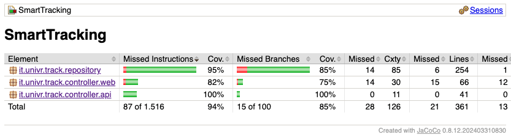

# Progetto del corso di Progettazione e Validazione del Software
## Gestione Devices

**Rigon Andrea** – VR532858  
**Binosi Dimitri** – VR538885  
**Marco Da Pozzo** - VR544104

---

## Index
- [Descrizione del progetto](#descrizione-del-progetto)
- [Attori e Responsabilità](#attori-e-responsabilità)
- [Interfaccia API](#interfaccia-api)
- [Interfaccia WEB](#interfaccia-web-dashboard-amministrativa)
- [Scenari](#scenari)
- [Quality Assurance](#quality-assurance)

---

## Descrizione generale del progetto

Questo sistema intelligente è progettato per raccogliere, trasmettere e archiviare dati provenenti da sensori installati su dispositivi a basso costo, garantendo il monitoraggio continuo delle condizioni fisiche dei prodotti durante il trasporto o lo stoccaggio.

I device sono dotati di uno o più sensori, in grado di rilevare parametri ambientali a intervalli regolari. I dati vengono
processati e archiviati sulla memoria del device, successivamente vengono trasmessi a una piattaforma cloud tramite
connessioni wireless. Infine vengono resi disponibili agli utenti tramite una dashboard, la quale viene visualizzata
scannerizzando un QrCode applicato sul prodotto desiderato.

## Attori e Responsabilità

### Employe
- Recupero di device riutilizzabili
- Assemblaggio di nuovi dispositivi
- Calibrazione dei sensori
- Connessione dei device al cloud

### Manager
- Visualizzazione dell'inventario dei device e sensori

## Interfaccia API

Il sistema deve esporre endpoint programmatici per le seguenti operazioni:

- **Decommissioning**  
  Eliminazione totale di un device

- **Lista Devices**  
  Recupero dell’elenco completo dei dispositivi registrati nel sistema

- **Visualizza Configurazione**  
  Lettura dei parametri attuali di un device  

- **Cambia Configurazione**  
  Modifica dei parametri operativi a livello logico

- **Invia Configurazione**  
  Trasmissione remota della configurazione al device fisico

---

## Interfaccia WEB (Dashboard Amministrativa)

Il portale gestionale destinato allo Staff e agli Employee deve consentire:

- **Decommissioning**
    - Gestione visiva del fine vita dei dispositivi

- **Lista Devices**
    - Stato del dispositivo (attivo / inattivo)
    - Origine (nuovo / riutilizzato)
    - Stato di calibrazione

- **Visualizza Configurazione**
    - Consultazione dei dettagli tecnici dei sensori associati

- **Cambia Configurazione**
    - Interfaccia grafica per la modifica dei parametri
    - Nessuna necessità di intervento diretto sul codice

---

# Scenari

## Visualizzazione lista devices

L’utente accede alla piattaforma per visualizzare la lista dei device attivi.

| Tipo | Descrizione |
|------|------------|
| Normal | I dati vengono caricati correttamente |
| What can go wrong | API non risponde / nessun device attivo |
| Other activities | — |
| System state on completion | Inalterato |

---

## Decommissioning vecchi devices

L’utente elimina device obsoleti o non più necessari.

| Tipo | Descrizione |
|------|------------|
| Normal | Eliminazione completata con successo |
| What can go wrong | API non risponde |
| Other activities | — |
| System state on completion | Device eliminato |

---

## Visualizza configurazione device

Dalla pagina principale l’utente accede alla vista di dettaglio della configurazione del device.

| Tipo | Descrizione |
|------|------------|
| Normal | Reindirizzamento corretto e configurazione visibile |
| What can go wrong | API non risponde / device inesistente |
| Other activities | — |
| System state on completion | Inalterato |

---

## Modifica configurazione device

L’utente accede alla pagina di modifica della configurazione del device.

| Tipo | Descrizione |
|------|------------|
| Normal | Configurazione modificabile correttamente |
| What can go wrong | API non risponde / device inesistente / parametri fuori dominio |
| Other activities | — |
| System state on completion | Configurazione aggiornata |

---

## Invio configurazione device

Dopo la modifica, l’utente rende permanenti le configurazioni del device.

| Tipo | Descrizione |
|------|------------|
| Normal | Configurazione salvata e applicata |
| What can go wrong | API non risponde / device inesistente / parametri non validi |
| Other activities | — |
| System state on completion | Configurazione aggiornata |

---

## Visualizza sensori del device

L’utente visualizza i sensori associati a un device e i relativi dettagli.

| Tipo | Descrizione |
|------|------------|
| Normal | Lista dei sensori visualizzata correttamente |
| What can go wrong | API non risponde / device inesistente / assenza di sensori |
| Other activities | — |
| System state on completion | Inalterato |

---

## Sensori non calibrati

L’utente invia una richiesta di calibrazione ai sensori del device.

| Tipo | Descrizione |
|------|------------|
| Normal | Calibrazione completata |
| What can go wrong | API non risponde / sensore non risponde / calibrazione fallita |
| Other activities | — |
| System state on completion | Sensore calibrato |

---

## Device non calibrato

L’utente calibra tutti i sensori di un device dalla vista dedicata.

| Tipo | Descrizione |
|------|------------|
| Normal | Calibrazione completata |
| What can go wrong | API non risponde / device non risponde / calibrazione fallita |
| Other activities | — |
| System state on completion | Device calibrato |

---

## Vista Manager

Il manager visualizza l’inventario completo di device e sensori.

| Tipo | Descrizione |
|------|------------|
| Normal | Dati caricati correttamente |
| What can go wrong | API non risponde |
| Other activities | — |
| System state on completion | Inalterato |
 

## Quality Assurance
Questa sezione descrive le strategie adottate per garantire la qualità del sistema,
con particolare attenzione alla selezione dei test, alla copertura dei test unitari
e ai test di accettazione (acceptance tests).

---
## Test Coverage (JaCoCo)

Per misurare l'efficacia della suite di test, abbiamo utilizzato **JaCoCo**. I risultati mostrano una copertura capillare della logica di business e dei punti di accesso ai dati.

### Analisi dei Risultati

* **Instruction Coverage Totale: 95%** – La vasta maggioranza del codice sorgente viene eseguita dai test.
* **Branch Coverage Totale: 85%** – Oltre l'80% dei percorsi decisionali (if/else) è verificato, garantendo stabilità contro i casi limite.
* **API Layer (100% Branch Coverage):** Il package `controller.api` è interamente coperto, assicurando che ogni possibile input alle API sia gestito correttamente.

## Test Selection

La selezione dei test è stata effettuata partendo dai requisiti funzionali e dagli
scenari principali del sistema, privilegiando le funzionalità critiche che:

- coinvolgono l’interazione dell’utente con l’interfaccia web;
- modificano lo stato persistente del sistema;
- richiedono comunicazione tra più componenti applicativi.

Sono stati inclusi sia casi nominali sia casi di errore, al fine di verificare
la robustezza del sistema.

### Scenari selezionati

I test coprono i seguenti scenari:

- Visualizzazione della lista dei device
- Calibrazione di un device
- Visualizzazione della configurazione di un device
- Modifica della configurazione di un device
- Invio della configurazione al device
- Decommissioning di un device
- Visualizzazione dell’inventario da parte del manager

### Dati di test

I test utilizzano un insieme controllato di dati iniziali composto da:

- utenti con ruolo Employee e Manager;
- device associati a utenti differenti;
- device con origine diversa (BUYED, ASSEMBLED);
- sensori calibrati e non calibrati.

Questo insieme consente di testare sia il comportamento standard del sistema sia
la corretta gestione delle differenti condizioni operative.

---

## Test Coverage (Unit Tests)

Gli unit test stati progettati per testare le singole unità ponendo
particolare attenzione alla validazione dei dati e alla gestione degli errori.

### Tipologia di copertura

- Statement coverage sulle operazioni di gestione dei device
- Branch coverage per la validazione dei parametri di configurazione
- Copertura dei casi di errore legati a device inesistenti o configurazioni non valide

Le dipendenze esterne sono state simulate o isolate quando necessario.
Si evidenzia l'utilizzo di Mockito in DeviceServiceMockTest ,SensorServiceMockTest e UserServiceMockTest

## Acceptance Tests

Gli acceptance tests sono stati implementati come test di sistema end-to-end e
verificano il comportamento complessivo dell’applicazione dal punto di vista
dell’utente finale.

I test simulano l’interazione reale con l’interfaccia web tramite browser,
utilizzando il Page Object Pattern e un contesto applicativo completo.
Per quanto riguarda l'implementazione vera e propria è stato utilizzato Selenium.

### Scenari coperti dagli acceptance tests

#### Calibrazione di un device

Un employe accede alla piattaforma, visualizza la lista dei device e calibra
un device non calibrato.  
Il test verifica l’aggiornamento dello stato del device e dell’interfaccia utente.

#### Visualizzazione configurazione device

Un employee accede alla pagina di configurazione di un device dalla lista principale.
Il test verifica la coerenza tra l’ID del device mostrato e quello persistito.

#### Modifica configurazione device

Un employee modifica la configurazione di un device rimuovendo un sensore e
inviando la nuova configurazione.
Il test verifica la persistenza delle modifiche effettuate.

#### Decommissioning di un device

Un employee elimina un device dalla lista dei device.
Il test verifica la rimozione del device e l’aggiornamento della lista.

#### Vista Manager

Un manager accede alla piattaforma e visualizza l’inventario completo dei device
e dei sensori associati.

---
## Repository Testing

Per quanto riguarda i test eseguiti sul database, come detto in precedenza si concentrano principalmente sulle tre entità **Device**, **Sensor**, **User**. I test sono scritti in modi molto simili, per questo, qua sotto, riporteremo la spiegazione di uno solo di questi file: **DeviceServiceTest**.

### Suite di test: `DeviceServiceTest`

La classe `DeviceServiceTest` esegue test unit assicurandosi che il database memorizzi in modo corretto le informazioni, gli oggetti vengano creati senza errori, le tabelle vengano popolate coerentemente e in caso contrario ciò venga segnalato nel modo più preciso e chiaro possibile. 
Importante sottolineare che i test sono eseguiti su oggetti (Device/Sensor...) creati all'interno del file stesso e che quindi, non utilizzano eventuali file esterni di inizializzazione del database, i quali potrebbero variare in futuro. 

Nel caso si volese aggiungere eventuali oggetti, la procedura si riduce alla creazione di questi ultimi e alla loro aggiunta alla corrispettiva lista. La procedura è comunque documentata all'interno del rispettivo file.

### Operazioni verificate:

| Test                           | Obiettivo                                                                                             | Verifica principale                                                     |
|--------------------------------|-------------------------------------------------------------------------------------------------------|-------------------------------------------------------------------------|
| **Create Device**              | Verifica che la creazione dei device proceda senza errori usando diversi tipi di costruttori          | Creazione device                                                        |
| **Register Device**            | Controlla l'inserimento di un device nella tabella del database                                       | Aggiunta dell'oggetto alla tabella                                      |
| **Count Devices**              | Verifica che il numero di device nel database sia corretto                                            | Il valore coincide con il numero di device salvati                      |
| **Get Device by**              | Assicurarsi che il device (ricercato tramite ID o User) riportato sia valido                          | Il device riportato non deve essere null e deve essere quello richiesto |
| **Check Parameters**           | Controlla la corretta memorizzazione dei dati nella tabella                                           | Corrispondenza dei dati tra quelli inseriti e memorizzati               |
| **Delete Device**              | Verifica la corretta cancellazione dei device tramite le diverse modalità                             | Eliminazione del device dalla tabella                                   |
| **Get/Add/Remove Sensor**      | Verifica il corretto recupero di un sensore tramite device e la sua aggiunta e rimozione ad un device | Sensor ritornato non nullo, Sensor aggiunto o rimosso non nullo         |
| **Get All Devices**            | Verifica che l'elenco di devices sia completo e corretto                                              | I devices ritornati sono quelli aggiunti al database in precedenza      |
| **Calibrate Sensor and Device** | Assicurarsi che il device e il sensore diventino calibrati                                            | I device e sensori diventano calibrati senza errori                     |

## API Integration Testing

Oltre agli unit e acceptance test, il sistema include una suite di **test di integrazione per le API REST**, implementata utilizzando il framework **RestAssured**. Questi test verificano che il livello controller e il livello service interagiscano correttamente e che il protocollo HTTP sia rispettato (codici di stato, formati JSON, parametri).

### Suite di test: `DeviceApiTest`

La classe `DeviceApiTest` esegue test automatici sugli endpoint principali del sistema (`/api/device`, `/api/devices`), operando in un ambiente Spring Boot controllato con profilo di test dedicato.

### Operazioni verificate:

| Test | Obiettivo | Verifica principale |
|------|-----------|---------------------|
| **Ping API** | Verifica la connettività di base. | Status 200 e testo "test". |
| **Add New Device** | Testa la creazione di un nuovo dispositivo tramite POST. | Persistenza del dato e correttezza dei valori (es. prezzo). |
| **Delete Device** | Verifica il decommissioning logico/fisico di un device. | Status 200 alla cancellazione e 404 alla successiva ricerca. |
| **Get All Devices by User** | Testa il filtraggio e l'isolamento dei dati per utente. | Corrispondenza tra numero di device attesi e ricevuti. |
| **Update Device** | Verifica la modifica dei parametri di un device esistente tramite PUT. | Persistenza della modifica (es. variazione prezzo). |
| **Unauthorized Access** | Testa la robustezza del sistema e la sicurezza. | Status 401 in caso di credenziali o utenti non validi. |

